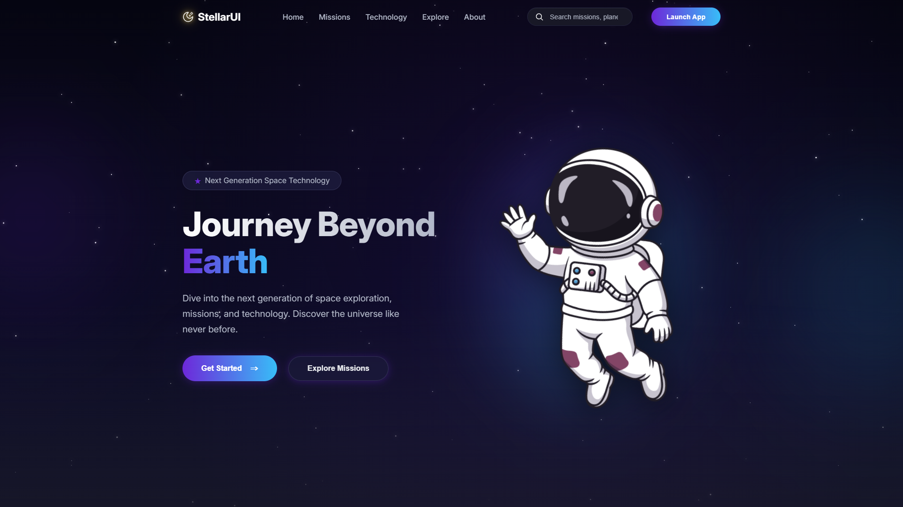
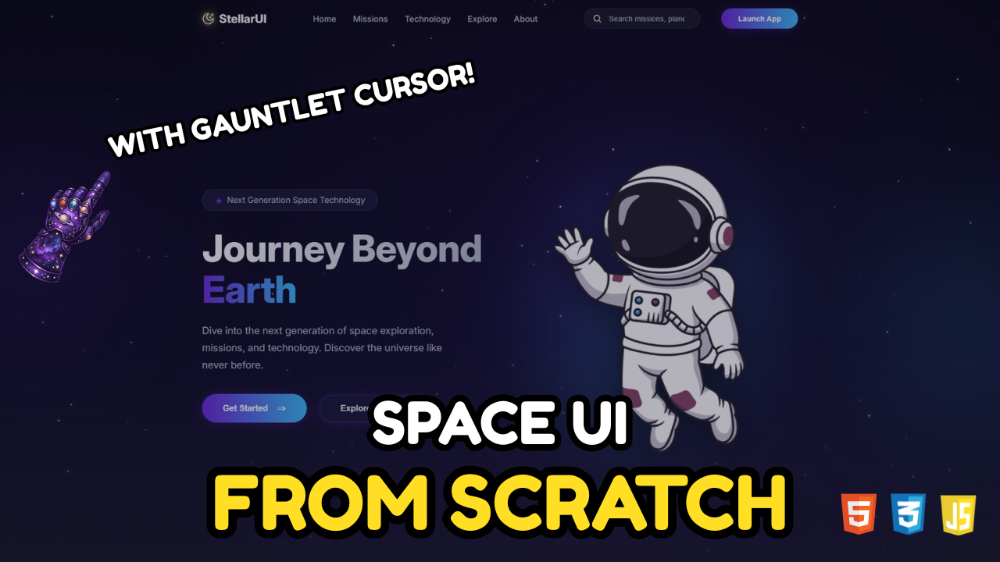

# 🌌 Stellar UI

A space-themed landing page built with plain HTML, CSS, and JavaScript. It mixes a responsive navbar, a starfield background, subtle motion, and custom gauntlet cursors to give the page a playful sci-fi feel without turning it into a heavy demo app.

## Preview

### Desktop



### Mobile


## What’s inside

- Responsive header with desktop navigation and a mobile sidebar menu
- Animated starfield hero section
- Custom cursor assets for default and pointer states
- Floating astronaut visual with layered glow effects
- Clean layout that scales down well on smaller screens

## Tech used

- HTML
- CSS
- JavaScript

## Project structure

```text
stellar-ui/
├── assets/
│   ├── icons/
│   ├── images/
│   └── readme/
├── hero.css
├── index.css
├── index.html
└── starfield.js
```

## Run locally

This is a static project, so you can open `index.html` directly in your browser.

If you prefer using VS Code Live Server or a similar local server, that works too.

## 🎥 Tutorial video

There is also a companion tutorial video for this project, where the layout is built step by step and the responsive behavior is explained along the way.



If you want to see how the pieces fit together, watch it here: [Stellar UI tutorial video.](https://youtu.be/3RgTAGp2FSE)
